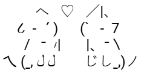

  

<h1 align="center">Hi, I׳m Theo Trosman</h1>
<h2 align="center">Full-Stack Student at ORT Yatay Argentina</h2>

  

--- 
### Backend Development

---

### Frontend Development

---

### Tools

---

Combining logic with style so every line of code has its own personality

